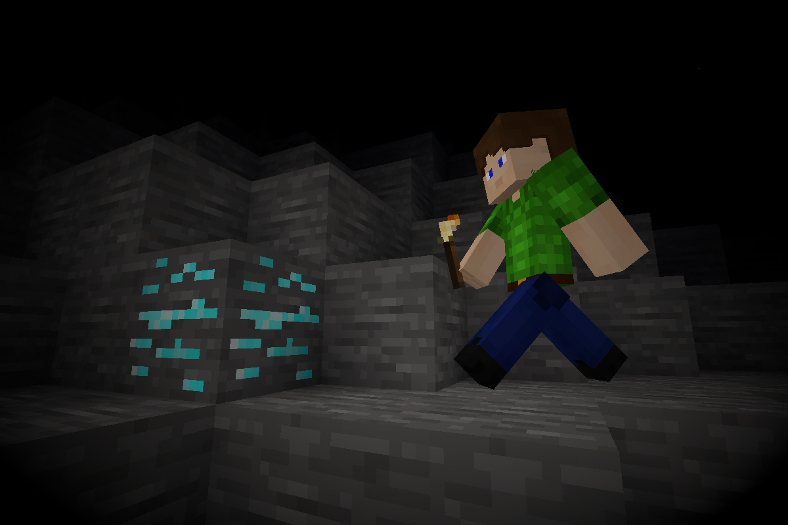

# Illumination [illumination]

Improved and maintained fork of [`minetest-illumination`](https://notabug.org/Piezo_/minetest-illumination) with added support for items, tools, and [`3d_armor`](https://github.com/minetest-mods/3d_armor).

